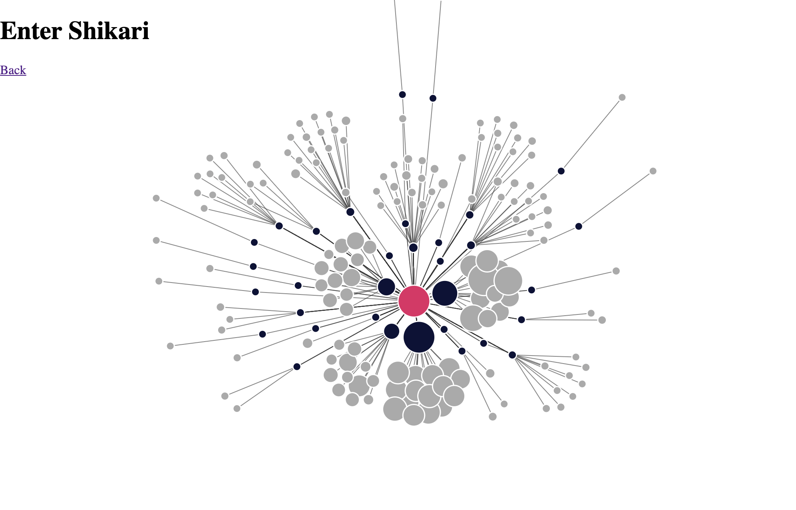

Shows little graphs/trees of your artists/albums/tracks from last.fm but can be modified to use any source if you're somewhat competent in computer

## How Tho?

1. Get your last.fm data in a csv format `Artist, Album, Track, Date`, no headers - I used [Last.fm to CSV](https://benjaminbenben.com/lastfm-to-csv/)
2. Run `npm install && node parse-csv.js` which generates the data files
3. Run simple http server e.g. `python -m "SimpleHTTPServer"`
4. Navigate to `http://localhost:8000/index2.html` and see stuff if it worked